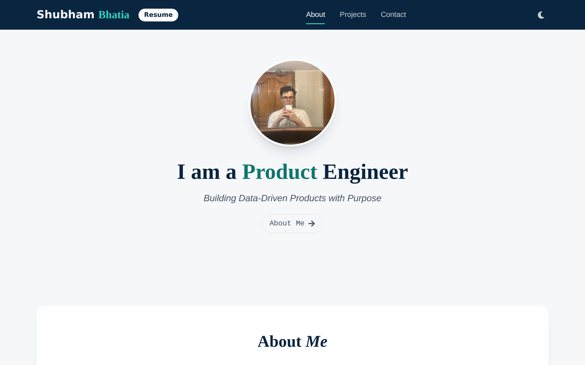

<div align="center">


### Personal portfolio — [shubhambhatia.in](https://shubhambhatia.in)

[](https://shubhambhatia.in)
[](https://github.com/shubhambhatia2103/Shubham-s-Portfolio/commits/master)
[](https://github.com/shubhambhatia2103/Shubham-s-Portfolio)
[](https://github.com/shubhambhatia2103/Shubham-s-Portfolio/stargazers)

<picture>
  <source media="(prefers-color-scheme: dark)" srcset=".github/assets/hero-dark.png">
  <source media="(prefers-color-scheme: light)" srcset=".github/assets/hero-light.png">
  
</picture>

<sub>👆 auto-switches with your GitHub theme — try toggling dark mode on the site itself</sub>

</div>

<br>

## Contents

- [What's here](#whats-here)
- [Features](#features)
- [Tech stack](#tech-stack)
- [Getting started](#getting-started)
- [Project structure](#project-structure)
- [Design system](#design-system)
- [Contact form](#contact-form)
- [Connect](#connect)

<br>

## What's here

A single-page portfolio built with React + Vite + Tailwind CSS — hero intro, about, project showcase, and a working contact form, wrapped in scroll-aware navigation and a light/dark theme toggle. Deployed at **[shubhambhatia.in](https://shubhambhatia.in)**.

<br>

## Features

<details open>
<summary><b>Click to expand</b></summary>

<br>

| | |
|---|---|
| 🌗 **Light / dark mode** | Manual toggle, persisted to `localStorage`, falls back to the OS `prefers-color-scheme` on first visit |
| 🧭 **Scroll-aware nav** | `IntersectionObserver`-driven active-section highlighting as you scroll |
| ✨ **Scroll reveals** | Sections fade/slide into view on scroll via Framer Motion |
| 📱 **Responsive** | Slide-in mobile nav drawer below the `lg` breakpoint |
| 📬 **Working contact form** | Submits via [Formspree](https://formspree.io), no backend required |
| ♿ **AA-accessible palette** | Every text/background pair verified against WCAG 2.2 AA contrast minimums |
| 🎨 **Token-based theming** | All color usage flows through a central Tailwind token set — no scattered hex values |

</details>

<br>

## Tech stack

<div align="center">


</div>

<div align="center">

`React 18` · `Vite 5` · `Tailwind CSS 3` · `Framer Motion` · `React Icons` · `ESLint`

</div>

<br>

## Getting started

```bash
# 1. Clone the repository
git clone https://github.com/shubhambhatia2103/Shubham-s-Portfolio.git
cd Shubham-s-Portfolio

# 2. Install dependencies
npm install

# 3. Start the dev server (http://localhost:5173)
npm run dev
```

<details>
<summary><b>Other scripts</b></summary>

<br>

| Command | What it does |
|---|---|
| `npm run build` | Production build to `dist/` |
| `npm run preview` | Serve the production build locally |
| `npm run lint` | Run ESLint |

</details>

<br>

## Project structure

<details>
<summary><b>Click to expand the file tree</b></summary>

```
src/
├── App.jsx              # Page shell — assembles sections, owns dark-mode state
├── main.jsx              # React entry point
├── index.css              # Font imports, global focus/selection styles
├── Components/
│   ├── Navbar.jsx          # Sticky nav, mobile drawer, dark-mode toggle
│   ├── Hero.jsx            # Intro section with profile photo
│   ├── About.jsx           # Bio + tool/skill chips
│   ├── Projects.jsx        # Project cards (image, tags, links)
│   ├── Contact.jsx         # Formspree-backed contact form
│   ├── Footer.jsx          # Social links
│   └── Reveal.jsx          # Shared scroll-reveal wrapper (Framer Motion)
├── hooks/
│   ├── useDarkMode.js       # Theme state + localStorage persistence
│   └── useActiveSection.js  # IntersectionObserver for nav highlighting
└── assets/               # Images
```

</details>

<br>

## Design system

Colors are defined once as Tailwind theme tokens (`tailwind.config.js`) and referenced by name everywhere else — components never hardcode hex values. The palette follows a 60/30/10 balance: neutral surface dominant, navy for structure and text, teal reserved for interactive/highlight moments.

<details>
<summary><b>Click to expand the token table</b></summary>

<br>

| Token | Value | Role |
|---|---|---|
| `surface` |  `#F6F7F9` | Page / section background (60%) |
| `surface-elevated` |  `#FFFFFF` | Card surfaces |
| `navy` |  `#0A2540` | Headings, nav, footer, dark sections (30%) |
| `body` |  `#475569` | Body text — 7.1:1 on `surface` |
| `line` |  `#E2E8F0` | Borders / dividers |
| `accent` |  `#14B8A6` | CTA fills (10%) |
| `accent-text` |  `#0F766E` | Accent as text/link — 5.1:1 on `surface` |
| `accent-dark` |  `#2DD4BF` | Accent text on dark surfaces — 8.4:1 on `navy` |

Every pairing above is checked against WCAG 2.2 AA (4.5:1 normal text, 3:1 large text/UI). Focus rings use the accent tone; `#14B8A6` is never used as small text or a thin border since it falls short of 3:1 on its own.

</details>

<br>

## Contact form

The [Contact](src/Components/Contact.jsx) section posts directly to [Formspree](https://formspree.io) client-side — no server code in this repo. Swap the endpoint in `Contact.jsx` if you fork this and want the form to go somewhere else.

<br>

## Connect

<div align="center">

[](https://github.com/shubhambhatia2103)
[](https://www.linkedin.com/in/shubhambhatia2103/)
[](https://www.instagram.com/6eingshubham/)
[](https://x.com/whoodattboyy)

<br>

<sub>Built by <a href="https://github.com/shubhambhatia2103">Shubham Bhatia</a> · <a href="#contents">back to top ↑</a></sub>

</div>
